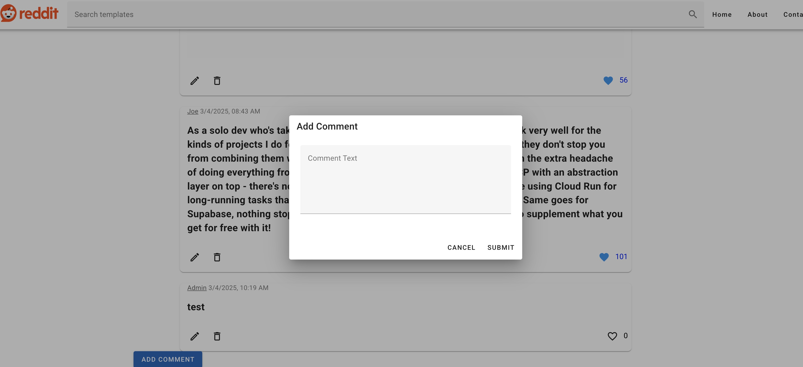

# Reddit

## Installation

### 1. Install Dependencies

Run the following command to install dependencies for both root and backend folders:

```bash
npm install
```

### 2. Frontend Setup

To run the frontend, use the following command:

```bash
npm run serve
```

Make sure the frontend is running on http://localhost:8084/.

### 3. Backend Setup

To start the backend, navigate to the backend directory and run:

```bash
node server.js
```

The backend should be running on http://localhost:3031/.

## Features

### Admin Access:

- Admin can see all comments, likes, and attached images.
  
- Admin has the ability to update or delete comment text.
  
- Admin can create new comments.
  

### Tech Stack

- Frontend: Vue 3, Vuetify 3
- Backend: Node.js, Express.js
- Database: SQL
- Deployment: Heroku
